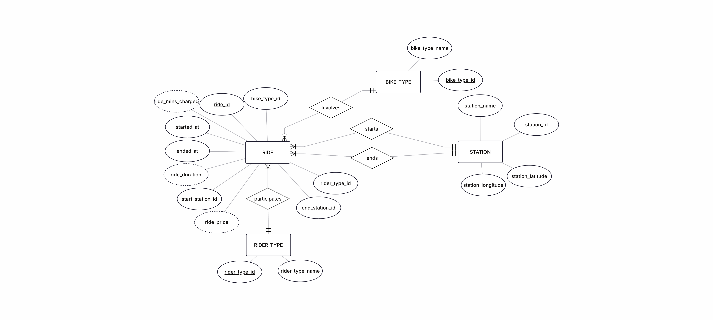
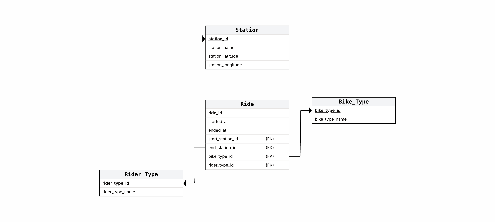

# Citi Bike Ride Analysis
## Prashant Chopra & Erhan Asad Javed

<div align="center">
  
</div>

## Project Overview

Citi Bike is New York City’s bike-sharing program, providing short-term bicycle rentals across the city. The system records detailed trip-level data, including ride duration, start and end locations, bike types, and rider membership status, making it a rich dataset for analyzing urban mobility patterns, user behavior, and transportation demand.

This is an ongoing **data analytics project** analyzing Citi Bike ride data for September 2024. The goal of the project is to understand rider behavior, bike usage patterns, and pricing outcomes through a full analytics workflow that spans **data engineering, SQL analysis, and data visualization**.

The project begins with downloading and cleaning raw Citi Bike trip data using Python, followed by feature engineering such as ride duration and per-ride price computation based on Citi Bike’s pricing rules. The cleaned dataset is then prepared for downstream analysis using **SQL** for querying and aggregation, and **Tableau** for interactive dashboards and visual insights.

Riders are classified as:
- **Casual riders**: users paying for a single ride or a day pass  
- **Members**: users subscribed to a Citi Bike membership  

As the project progresses, additional analysis will be conducted to explore temporal usage patterns, revenue implications, and differences between casual and member riding behavior.


## Data Source
The raw data consists of Citi Bike trip data files hosted on [Google Drive](https://drive.google.com/drive/folders/1NhBgnlArKS2kISV44Cl-JOexjGWTcllE). Each file represents a portion of September 2024 ride activity.

**Original files:**
- `202409-citibike-tripdata_1.csv`
- `202409-citibike-tripdata_2.csv`
- `202409-citibike-tripdata_3.csv`
- `202409-citibike-tripdata_4.csv`
- `202409-citibike-tripdata_5.csv`

**Data Download**

The files are downloaded programmatically using `gdown` and saved locally to `data/raw/` by running the Python script:

```bash
python -m src.download_and_combine
```


## Data Cleaning & Preprocessing
The following preprocessing steps are applied:

1. **Combine datasets**
   - All September CSV files are concatenated into a single DataFrame.

2. **Datetime conversion**
   - `started_at` and `ended_at` are converted to pandas datetime objects.

3. **Ride duration**
   - `ride_duration_min` is computed as the difference between `ended_at` and `started_at`.
   - Ride durations are **rounded up to the nearest minute** to match Citi Bike billing rules.

4. **Missing data**
   - All rows containing **any null values** are removed.


## Pricing Logic
A per-ride price is computed based on Citi Bike’s pricing rules.

### Rider Types
- **Casual**: single ride or day pass  
- **Member**: annual membership  

### Included Ride Time
| Rider Type | Included Minutes |
|-----------|------------------|
| Casual    | 30 minutes       |
| Member    | 45 minutes       |

### Per-Minute Rates
- **Classic / Docked bikes**
  - $0/min within included time
- **Electric bikes**
  - Casual: $0.38/min  
  - Member: $0.25/min  

### Overage Charges
- Any minute beyond the included ride time incurs an **additional $0.25/min**
- Applies to **both classic and electric bikes**
- Overage minutes are charged at:  
  **base rate + $0.25**


### Key Columns
- `ride_id`
- `rideable_type`
- `started_at`
- `ended_at`
- `start_station_name`
- `start_station_id`
- `end_station_name`
- `end_station_id`
- `member_casual`
- `ride_duration_min`
- `ride_minutes_charged`
- `ride_price`

The dataset contains no missing values and is ready for analysis.


## Tools and Libraries
- Python
- pandas
- numpy
- gdown

## 🗂️ Database Design & Normalization

To support efficient querying and analysis, the original Citi Bike dataset was normalized and structured into a relational database. Prior to analysis, an Entity Relationship Diagram (ERD) was created to guide the database design and ensure proper normalization.

### Normalization Rationale

The initial dataset satisfies First Normal Form (1NF). All attributes contain atomic values, there are no repeating groups or multivalued attributes, and each record is uniquely identifiable by `ride_id`.

The dataset also satisfies Second Normal Form (2NF). Since the primary key consists of a single attribute (`ride_id`), partial dependencies are not possible, and all non-key attributes are fully functionally dependent on the primary key.

However, the dataset does not satisfy Third Normal Form (3NF) due to the presence of transitive dependencies. For example:

- `start_station_id → station_name, station_latitude, station_longitude`
- `end_station_id → station_name, station_latitude, station_longitude`

Because `ride_id` determines the station IDs, and the station IDs in turn determine station attributes, these relationships introduce transitive dependencies that violate 3NF.

Additionally, categorical attributes such as rider type (member vs. casual) and bike type (classic vs. electric) are repeated across a large number of records. Although these attributes are functionally dependent on ride_id, storing them directly in the ride table would result in unnecessary redundancy and reduced maintainability.

To resolve these issues, the dataset was decomposed into separate relations for Ride, Station, Bike Type, and Rider Type. This decomposition ensures that all non-key attributes depend only on the primary key of their respective tables, thereby satisfying Third Normal Form (3NF).

### Final Normalized Schema

**Table**: `RIDE`
- `ride_id (PK)`
- `started_at`
- `ended_at`
- `start_station_id (FK → STATION.station_id)`
- `end_station_id (FK → STATION.station_id)`
- `bike_type_id (FK → BIKE_TYPE.bike_type_id)`
- `rider_type_id (FK → RIDER_TYPE.rider_type_id)`

**Table**: `STATION`
- `station_id (PK)`
- `station_name`
- `station_latitude`
- `station_longitude`

**Table**: `BIKE_TYPE`
- `bike_type_id (PK)`
- `bike_type_name (e.g., classic_bike, electric_bike)`

**Table**: `RIDER_TYPE`
- `rider_type_id (PK)` 
- `rider_type_name (e.g., member, casual)`

### Design Outcome

This normalized schema reduces redundancy, improves data integrity, and enables flexible analytical queries across rider behavior, bike usage, station activity, and temporal patterns. The resulting structure was implemented in PostgreSQL using Supabase and served as the foundation for all subsequent SQL analysis and visualizations.

### Entity Relationship Diagram
<div align="center">
  
</div>

### Relational Schema
<div align="center">
  
</div>

## 📊 SQL Findings: Citi Bike Usage & Revenue Analysis
### Data Scope & Methodology

Due to storage and performance limitations within Supabase (the PostgreSQL database used for querying), this analysis was conducted on a [20000-row subset](https://drive.google.com/drive/folders/1jVOpmbqFMiJbOy9i3ysy_7Luif6UVbtH) of the original Citi Bike dataset, which contains approximately 5 million records for the month. To reduce sampling bias, the subset was randomly selected across the entire month, ensuring representation from different days, times of day, rider types, and bike types. While smaller in scale, this randomized sample provides a highly representative snapshot of overall system behaviour and supports reliable exploratory analysis of usage and revenue patterns.

### Key Findings (Summary)
- Members account for ~80% of total trips but only ~56% of total revenue
- Casual riders earn 2–4× more revenue per trip than members
- Electric bikes generate nearly all system revenue
- Evening and late-night hours are the most revenue-efficient
- Morning commute periods are high-volume but low-value
- Weekends favour casual riders and higher per-trip revenue
- Peak utilization does not equal peak monetization

### Rider Type Utilization vs. Revenue

Member riders dominate overall usage, accounting for approximately 79% of trips, which aligns with frequent, routine commuting behavior. However, member trips contribute only ~56% of total revenue, reflecting a lower average revenue per trip. In contrast, casual riders represent only ~21% of total trips, yet generate ~44% of system revenue. This imbalance is primarily driven by longer trip durations and higher pricing exposure for casual riders.

**Insight**: Members sustain system utilization, while casual riders disproportionately drive revenue.

### Bike Type Performance

Electric bikes account for the majority of trips (~66%) and generate the overwhelming share of total revenue. Classic bikes, while still used, contribute minimally to revenue. Notably, average trip duration is nearly identical between electric and classic bikes, indicating that revenue differences are driven by pricing structure rather than ride length.

**Insight**: Electric bikes function as the system’s primary monetization lever.

### Hourly Usage and Revenue Patterns

Trip volume peaks during traditional commute windows (6–9 AM and 3–7 PM), driven largely by member riders. However, average revenue per trip is highest during late-night and early-morning hours (12–4 AM), when overall trip volume is lower. These off-peak periods are dominated by casual riders and higher-value trips.

**Insight**: The most profitable trips occur outside peak demand hours.

### Weekday vs. Weekend Dynamics

Member usage is significantly higher on weekdays, consistent with commuter behavior, while both trip volume and revenue decline on weekends. Casual riders, however, exhibit slightly higher average trips per day on weekends, alongside the highest average revenue per trip across both weekday and weekend periods.

**Insight**: Weekdays reflect commuter demand; weekends capture leisure-driven revenue.

### Overall Conclusion

Citi Bike’s usage patterns reveal a clear volume–value tradeoff. High-frequency member trips sustain daily utilization, while lower-frequency casual and electric bike trips disproportionately contribute to revenue. Peak trip volume does not align with peak revenue efficiency, highlighting opportunities for pricing optimization, fleet allocation, and demand-based strategy adjustments.
